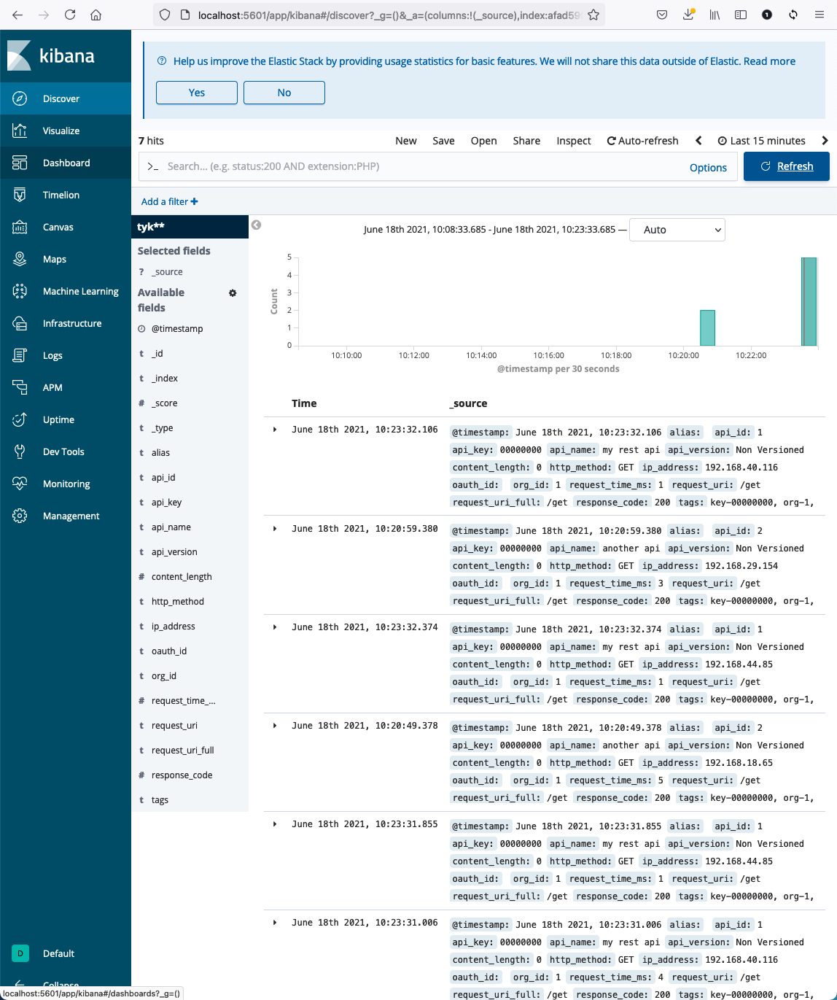

## Logging & Observability with Elastic Search

Let's add ELK stack and have Tyk push ingress API analytics to ELK.

1. Step 1, Install ElasticSearch, Kibana, and Tyk Pump 
```
$ kubectl apply -f part-2/.
configmap/elastic-config created
deployment.apps/elasticsearch created
service/elasticsearch-master created
deployment.apps/kibana created
configmap/pump-config created
deployment.apps/tyk-pump created
```

2. Make a couple API calls through the Gateway
```
$ curl $(kubectl get svc tyk-svc --output jsonpath='{.status.loadBalancer.ingress[0].hostname}'):8080/another-api/get
{
  "args": {},
  "headers": {
    "Accept": "*/*",
    "Accept-Encoding": "gzip",
    "Host": "another-api:8000",
    "User-Agent": "curl/7.64.1"
  },
  "origin": "192.168.29.154",
  "url": "http://another-api:8000/get"
}
```


3. Port forward to access Kibana, create the index, and view the logs, scraped by Tyk Pump and pushed to ELK.
```
$ kubectl port-forward deployment/kibana 5601
Forwarding from 127.0.0.1:5601 -> 5601
Forwarding from [::1]:5601 -> 5601
```

